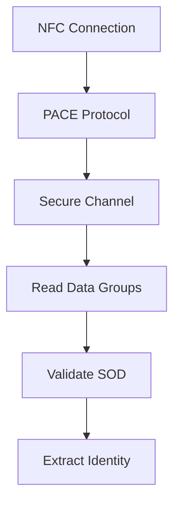

# Guía de Implementación: Lectura y Validación del DNIe Español

## Índice
1. [Introducción](#introducción)
2. [Arquitectura Actual](#arquitectura-actual)
3. [Roadmap de Implementación](#roadmap-de-implementación)
4. [Fase 1: Comunicación NFC Base](#fase-1-comunicación-nfc-base)
5. [Fase 2: Protocolo PACE](#fase-2-protocolo-pace)
6. [Fase 3: Secure Messaging](#fase-3-secure-messaging)
7. [Fase 4: Lectura de Data Groups](#fase-4-lectura-de-data-groups)
8. [Fase 5: Validación Criptográfica](#fase-5-validación-criptográfica)
9. [Fase 6: Extracción de Identidad](#fase-6-extracción-de-identidad)
10. [Testing y Debugging](#testing-y-debugging)
11. [Referencias](#referencias)

---

## Introducción

El DNIe (Documento Nacional de Identidad electrónico) español es un documento ICAO 9303 que utiliza tecnología NFC (ISO 14443) para comunicación sin contacto. La lectura del DNIe requiere implementar:

- **Protocolo PACE** (Password Authenticated Connection Establishment)
- **Secure Messaging** según ISO 7816-4
- **Lectura de Data Groups** según ICAO 9303
- **Validación SOD** (Security Object Document)

### Requisitos Previos
- Conocimientos básicos de criptografía
- Comprensión de APDUs ISO 7816-4
- Familiaridad con ASN.1/DER encoding
- DNIe físico para testing
- CAN (Card Access Number) del DNIe

---

## Arquitectura Actual

### Estado Actual del Código

```
ColeHop/
├── Services/Nfc/
│   ├── NfcService.cs              ✅ Implementado
│   ├── INfcPlatformService.cs     ✅ Implementado
│   ├── Dnie/
│   │   ├── DnieSession.cs         ⚠️ Estructura OK, lógica pendiente
│   │   ├── PaceSession.cs         ⚠️ Parcial - placeholders críticos
│   │   ├── DnieFileReader.cs      ❌ Por implementar
│   │   ├── SodValidator.cs        ❌ Por implementar
│   │   └── DnieIdentityExtractor.cs ❌ Por implementar
├── Platforms/
│   └── Android/Nfc/
│       └── AndroidNfcPlatformService.cs ✅ Implementado
```

### Flujo Actual
```
Usuario introduce CAN → BeginDnieReadingAsync →
WaitForTagAsync → DnieSession.ExecuteAsync →
❌ FALLA EN PACE (línea 41)
```

---

## Roadmap de Implementación

### Visión General



**Tiempo estimado total**: 4-6 semanas (dependiendo de experiencia)

**Fases**:
1. ✅ Comunicación NFC Base (COMPLETADO)
2. 🔨 Protocolo PACE (2-3 semanas)
3. 🔨 Secure Messaging (1 semana)
4. 🔨 Lectura de Data Groups (1 semana)
5. 🔨 Validación Criptográfica (1 semana)
6. 🔨 Extracción de Identidad (3-5 días)

---

## Fase 1: Comunicación NFC Base

### ✅ Estado: COMPLETADO

#### Logros Actuales
- ✅ Detección de tags NFC
- ✅ Conexión ISO-DEP
- ✅ Envío y recepción de APDUs
- ✅ Gestión de timeout (10 segundos)
- ✅ Manejo de errores y cancelación

#### Validación
```csharp
// Ya funcional en AndroidNfcPlatformService.TransceiveAsync
var apdu = new byte[] { 0x00, 0xA4, 0x04, 0x00, 0x00 }; // SELECT
var result = await _platformService.TransceiveAsync(apdu, cancellationToken);
// result.IsValid debería ser true
```

---

## Fase 2: Protocolo PACE

### 🎯 Objetivo
Establecer un canal autenticado con el DNIe usando el CAN como password.

### Conceptos Necesarios

#### 2.1 ¿Qué es PACE?
PACE (Password Authenticated Connection Establishment) es un protocolo criptográfico que:
- Autentica el lector usando el CAN
- Establece claves de sesión seguras
- Protege contra ataques de fuerza bruta

#### 2.2 Flujo PACE Completo

```
Terminal                                 Chip
   |                                      |
   |  1. MSE:Set AT (Protocol PACE)      |
   |------------------------------------->|
   |                                      |
   |  2. General Authenticate (Get Nonce)|
   |------------------------------------->|
   |      Encrypted Nonce (z)             |
   |<-------------------------------------|
   |                                      |
   |  3. Decrypt z using K_pi (from CAN)  |
   |      s = Decrypt(z, K_pi)            |
   |                                      |
   |  4. Generate ECDH keypair (SK_t, PK_t)|
   |      Map point: G' = s·G             |
   |      Calculate: Y_t = SK_t·G'        |
   |                                      |
   |  5. General Authenticate (Send Y_t)  |
   |------------------------------------->|
   |      Y_c (chip public key)           |
   |<-------------------------------------|
   |                                      |
   |  6. Calculate shared secret:         |
   |      K = SK_t·Y_c                    |
   |      Derive: K_enc, K_mac            |
   |                                      |
   |  7. Mutual Authentication (MAC)      |
   |------------------------------------->|
   |<-------------------------------------|
   |                                      |
   |  ✅ Secure Channel Established       |
```

### Documentación de Referencia

**Documentos Esenciales**:
1. **TR-03110** (BSI - Federal Office for Information Security, Alemania)
   - URL: https://www.bsi.bund.de/EN/Themen/Unternehmen-und-Organisationen/Standards-und-Zertifizierung/Technische-Richtlinien/TR-nach-Thema-sortiert/tr03110/tr-03110.html
   - Sección 4: PACE Protocol
   - **Crítico**: Apartado 4.2 (Generic Mapping)

2. **ICAO Doc 9303 Part 11** (Machine Readable Travel Documents)
   - URL: https://www.icao.int/publications/pages/publication.aspx?docnum=9303
   - Part 11: Security Mechanisms for MRTDs

3. **DNIe 3.0 Technical Specification** (DGP España)
   - Buscar: "Especificaciones técnicas DNIe 3.0 PDF"
   - Contiene APDUs específicos del DNIe español

### Implementación Paso a Paso

#### PASO 2.1: MSE:Set AT (Selección de Protocolo)

**Objetivo**: Indicar al chip que queremos usar PACE con el CAN.

**APDU**:
```
CLA  INS  P1   P2   Lc   Data
00   22   C1   A4   0F   80 0A 04 00 7F 00 07 02 02 04 02 02 83 01 02
```

**Desglose**:
- `CLA=00`: Clase estándar ISO
- `INS=22`: MANAGE SECURITY ENVIRONMENT
- `P1=C1`: Set for internal authentication
- `P2=A4`: Authentication template
- `Data`: TLV indicando PACE-CAM (CAN Access Mode)

**Implementación**:
```csharp
private async Task SendMseSetAtAsync(CancellationToken cancellationToken)
{
	// OID PACE (id-PACE-ECDH-GM-AES-CBC-CMAC-128)
	// 0.4.0.127.0.7.2.2.4.2.2
	var oidPace = new byte[] { 0x04, 0x00, 0x7F, 0x00, 0x07, 0x02, 0x02, 0x04, 0x02, 0x02 };

	// Construir TLV
	var data = new List<byte>();
	data.Add(0x80); // Tag: Protocol OID
	data.Add((byte)oidPace.Length);
	data.AddRange(oidPace);
	data.Add(0x83); // Tag: Reference of password
	data.Add(0x01);
	data.Add(0x02); // CAN reference

	var apdu = new List<byte>
	{
		0x00, 0x22, 0xC1, 0xA4, // CLA INS P1 P2
		(byte)data.Count        // Lc
	};
	apdu.AddRange(data);
	apdu.Add(0x00); // Le (esperar respuesta)

	await TransceiveOrThrowAsync(apdu.ToArray(), cancellationToken);
}
```

**Respuesta Esperada**:
```
90 00 (Success)
```

**Testing**:
```csharp
// En un test unitario o logging
System.Diagnostics.Debug.WriteLine($"MSE:Set AT enviado correctamente");
```

---

#### PASO 2.2: General Authenticate - Obtener Nonce Cifrado

**Objetivo**: Solicitar el nonce cifrado del chip.

**APDU**:
```
CLA  INS  P1   P2   Lc   Data          Le
00   86   00   00   02   7C 00         00
```

**Desglose**:
- `INS=86`: GENERAL AUTHENTICATE
- `Data=7C 00`: Dynamic Authentication Data (vacío, solicitar)
- `Le=00`: Esperamos datos de respuesta

**Implementación**:
```csharp
private async Task<byte[]> RequestEncryptedNonceAsync(CancellationToken cancellationToken)
{
	var apdu = new byte[] { 0x00, 0x86, 0x00, 0x00, 0x02, 0x7C, 0x00, 0x00 };
	var response = await TransceiveAndReturnDataAsync(apdu, cancellationToken);

	// La respuesta viene en formato TLV: 7C Len 80 Len <encrypted_nonce>
	// Necesitamos extraer el nonce cifrado
	return ParseEncryptedNonceFromTlv(response);
}

private static byte[] ParseEncryptedNonceFromTlv(byte[] tlvData)
{
	// Parsear estructura TLV
	// Formato esperado: 7C <len> 80 <len> <nonce_data>

	if (tlvData.Length < 4 || tlvData[0] != 0x7C)
		throw new InvalidOperationException("Formato TLV inválido para nonce cifrado");

	int offset = 2; // Saltar 7C y su length

	if (tlvData[offset] != 0x80)
		throw new InvalidOperationException("Tag 80 esperado para nonce cifrado");

	offset++; // Saltar tag 80
	int nonceLength = tlvData[offset];
	offset++;

	var nonce = new byte[nonceLength];
	Array.Copy(tlvData, offset, nonce, 0, nonceLength);

	return nonce;
}
```

**Respuesta Esperada**:
```
7C 12 80 10 <16 bytes encrypted nonce> 90 00
```

---

#### PASO 2.3: Descifrado del Nonce

**Objetivo**: Descifrar el nonce usando la clave derivada del CAN.

**Algoritmo**:
1. Derivar K_pi del CAN usando SHA-256
2. Descifrar el nonce con AES-128-CBC (sin IV o IV=0)

**Implementación**:
```csharp
private static byte[] DeriveKeyFromCan(string can)
{
	// K_pi = SHA-256(CAN)
	var digest = new Sha256Digest();
	var input = System.Text.Encoding.ASCII.GetBytes(can);
	digest.BlockUpdate(input, 0, input.Length);

	var hash = new byte[digest.GetDigestSize()];
	digest.DoFinal(hash, 0);

	// Tomar solo los primeros 16 bytes para AES-128
	return hash.Take(16).ToArray();
}

private static byte[] DecryptNonce(byte[] encryptedNonce, byte[] kPi)
{
	// AES-128-CBC con IV = 0
	var cipher = CipherUtilities.GetCipher("AES/CBC/NoPadding");
	var keyParam = new KeyParameter(kPi);
	var ivParam = new ParametersWithIV(keyParam, new byte[16]); // IV = 0

	cipher.Init(false, ivParam); // false = descifrar

	return cipher.DoFinal(encryptedNonce);
}
```

**Testing**:
```csharp
// Validar longitud
Debug.Assert(decryptedNonce.Length == 16, "Nonce debe tener 16 bytes");
System.Diagnostics.Debug.WriteLine($"Nonce descifrado: {BitConverter.ToString(decryptedNonce)}");
```

---

#### PASO 2.4: Mapping PACE (Generic Mapping)

**Objetivo**: Mapear el punto generador de la curva elíptica usando el nonce.

**Conceptos Criptográficos**:
- Curva elíptica: **brainpoolP256r1** (usada por DNIe)
- Punto generador original: G
- Punto generador mapeado: G' = s·G (donde s es el nonce descifrado interpretado como escalar)

**Implementación**:
```csharp
private static ECPoint MapGenerator(byte[] nonce, ECDomainParameters domainParams)
{
	// Interpretar nonce como BigInteger (escalar)
	var s = new Org.BouncyCastle.Math.BigInteger(1, nonce);

	// G' = s·G
	var mappedGenerator = domainParams.G.Multiply(s).Normalize();

	return mappedGenerator;
}
```

---

#### PASO 2.5: Generar Par de Claves ECDH del Terminal

**Objetivo**: Generar clave privada y pública efímera para el acuerdo ECDH.

**Implementación** (ya parcialmente correcta):
```csharp
private static (ECPublicKeyParameters pubKey, ECPrivateKeyParameters privKey) 
	GenerateEcdhKeyPair(ECPoint mappedGenerator, ECDomainParameters originalDomain)
{
	// IMPORTANTE: Usar G' como generador
	var mappedDomain = new ECDomainParameters(
		originalDomain.Curve,
		mappedGenerator,      // G' en lugar de G
		originalDomain.N,
		originalDomain.H
	);

	var gen = new ECKeyPairGenerator();
	gen.Init(new ECKeyGenerationParameters(mappedDomain, new SecureRandom()));
	var keyPair = gen.GenerateKeyPair();

	return (
		(ECPublicKeyParameters)keyPair.Public,
		(ECPrivateKeyParameters)keyPair.Private
	);
}
```

**⚠️ CRÍTICO**: El generador debe ser G', no G. Este es el error más común.

---

#### PASO 2.6: Enviar Clave Pública del Terminal

**Objetivo**: Enviar PK_terminal al chip.

**Formato de la Clave Pública**:
- Encoding: Sin comprimir (0x04 + X + Y)
- Longitud: 65 bytes para brainpoolP256r1

**APDU**:
```
CLA  INS  P1   P2   Lc   Data                              Le
00   86   00   00   43   7C 41 81 3F <65 bytes PK_term>   00
```

**Implementación**:
```csharp
private async Task SendMappingDataAsync(ECPublicKeyParameters publicKey, CancellationToken cancellationToken)
{
	// Codificar clave pública (sin comprimir)
	var pkBytes = publicKey.Q.GetEncoded(false); // false = sin comprimir

	// Construir TLV
	var data = new List<byte>();
	data.Add(0x7C); // Dynamic Authentication Data
	data.Add((byte)(pkBytes.Length + 2));
	data.Add(0x81); // Ephemeral Public Key
	data.Add((byte)pkBytes.Length);
	data.AddRange(pkBytes);

	var apdu = new List<byte>
	{
		0x00, 0x86, 0x00, 0x00,
		(byte)data.Count
	};
	apdu.AddRange(data);
	apdu.Add(0x00); // Le

	await TransceiveOrThrowAsync(apdu.ToArray(), cancellationToken);
}
```

---

#### PASO 2.7: Recibir Clave Pública del Chip

**Objetivo**: Parsear la respuesta del chip para extraer su clave pública.

**Formato de Respuesta**:
```
7C <len> 82 <len> <65 bytes PK_chip> 90 00
```

**Implementación** (actualmente retorna null ❌):
```csharp
private async Task<ECPublicKeyParameters> ReceiveChipPublicKeyAsync(
	ECDomainParameters mappedDomain, 
	CancellationToken cancellationToken)
{
	var apdu = new byte[] { 0x00, 0x86, 0x00, 0x00, 0x02, 0x7C, 0x00, 0x00 };
	var response = await TransceiveAndReturnDataAsync(apdu, cancellationToken);

	// Parsear TLV: 7C <len> 82 <len> <PK_chip>
	var pkChipBytes = ParseChipPublicKeyFromTlv(response);

	// Decodificar punto de curva elíptica
	var pkChipPoint = mappedDomain.Curve.DecodePoint(pkChipBytes);

	return new ECPublicKeyParameters("ECDH", pkChipPoint, mappedDomain);
}

private static byte[] ParseChipPublicKeyFromTlv(byte[] tlvData)
{
	if (tlvData.Length < 4 || tlvData[0] != 0x7C)
		throw new InvalidOperationException("Formato TLV inválido para PK chip");

	int offset = 2; // Saltar 7C y su length

	if (tlvData[offset] != 0x82)
		throw new InvalidOperationException("Tag 82 esperado para PK chip");

	offset++;
	int pkLength = tlvData[offset];
	offset++;

	var pk = new byte[pkLength];
	Array.Copy(tlvData, offset, pk, 0, pkLength);

	return pk;
}
```

**⚠️ CRÍTICO**: La clave pública del chip DEBE usar el mismo dominio mapeado (G').

---

#### PASO 2.8: Calcular Secreto Compartido y Derivar Claves

**Objetivo**: Realizar ECDH y derivar K_enc y K_mac.

**Implementación** (corregir para usar dominio correcto):
```csharp
private static byte[] ComputeSharedSecret(
	ECPrivateKeyParameters privateKey, 
	ECPublicKeyParameters chipPublicKey)
{
	// Verificar que ambas claves usan el mismo dominio
	if (!privateKey.Parameters.Curve.Equals(chipPublicKey.Parameters.Curve))
		throw new InvalidOperationException("Las claves no están en el mismo dominio EC");

	var agreement = new ECDHBasicAgreement();
	agreement.Init(privateKey);
	var secret = agreement.CalculateAgreement(chipPublicKey);

	return secret.ToByteArrayUnsigned();
}

private static (byte[] kEnc, byte[] kMac) DeriveSessionKeys(byte[] sharedSecret, byte[] nonce)
{
	// KDF según TR-03110 Section 4.2.3
	// counter = 0x00000001 para K_enc
	// counter = 0x00000002 para K_mac

	byte[] kEnc = KdfCounter(sharedSecret, nonce, 1);
	byte[] kMac = KdfCounter(sharedSecret, nonce, 2);

	return (kEnc.Take(16).ToArray(), kMac.Take(16).ToArray());
}

private static byte[] KdfCounter(byte[] sharedSecret, byte[] nonce, int counter)
{
	// K = SHA-256(shared_secret || counter || nonce)
	var digest = new Sha256Digest();

	digest.BlockUpdate(sharedSecret, 0, sharedSecret.Length);

	var counterBytes = BitConverter.GetBytes(counter);
	if (BitConverter.IsLittleEndian)
		Array.Reverse(counterBytes); // Big-endian
	digest.BlockUpdate(counterBytes, 0, 4);

	digest.BlockUpdate(nonce, 0, nonce.Length);

	var output = new byte[digest.GetDigestSize()];
	digest.DoFinal(output, 0);

	return output;
}
```

---

#### PASO 2.9: Autenticación Mutua

**Objetivo**: Probar que ambos lados conocen el secreto compartido.

**APDU**:
```
CLA  INS  P1   P2   Lc   Data                  Le
00   86   00   00   0C   7C 0A 85 08 <MAC_t>   00
```

**Implementación**:
```csharp
private async Task PerformMutualAuthenticationAsync(
	byte[] kMac, 
	ECPublicKeyParameters terminalPubKey,
	ECPublicKeyParameters chipPubKey,
	CancellationToken cancellationToken)
{
	// Calcular MAC sobre las claves públicas
	// MAC_t = CMAC(K_mac, PK_terminal || PK_chip)

	var pkTermBytes = terminalPubKey.Q.GetEncoded(false);
	var pkChipBytes = chipPubKey.Q.GetEncoded(false);

	var dataToMac = pkTermBytes.Concat(pkChipBytes).ToArray();
	var mac = CalculateCmac(kMac, dataToMac);

	// Enviar MAC al chip
	var data = new List<byte>();
	data.Add(0x7C);
	data.Add(0x0A);
	data.Add(0x85); // Authentication Token
	data.Add(0x08);
	data.AddRange(mac.Take(8)); // Solo primeros 8 bytes

	var apdu = new List<byte>
	{
		0x00, 0x86, 0x00, 0x00,
		(byte)data.Count
	};
	apdu.AddRange(data);
	apdu.Add(0x00);

	var response = await TransceiveAndReturnDataAsync(apdu.ToArray(), cancellationToken);

	// Verificar MAC del chip (respuesta: 7C 0A 86 08 <MAC_c>)
	var macChip = ParseMacFromTlv(response);

	// Calcular MAC esperado del chip
	var dataToMacChip = pkChipBytes.Concat(pkTermBytes).ToArray();
	var expectedMac = CalculateCmac(kMac, dataToMacChip);

	if (!macChip.SequenceEqual(expectedMac.Take(8)))
		throw new InvalidOperationException("Autenticación mutua falló: MAC inválido");
}

private static byte[] CalculateCmac(byte[] key, byte[] data)
{
	// AES-CMAC según NIST SP 800-38B
	var mac = MacUtilities.GetMac("AESCMAC");
	mac.Init(new KeyParameter(key));
	mac.BlockUpdate(data, 0, data.Length);

	var output = new byte[mac.GetMacSize()];
	mac.DoFinal(output, 0);

	return output;
}

private static byte[] ParseMacFromTlv(byte[] tlvData)
{
	if (tlvData.Length < 4 || tlvData[0] != 0x7C)
		throw new InvalidOperationException("Formato TLV inválido para MAC");

	int offset = 2;
	if (tlvData[offset] != 0x86)
		throw new InvalidOperationException("Tag 86 esperado para MAC chip");

	offset++;
	int macLength = tlvData[offset];
	offset++;

	var mac = new byte[macLength];
	Array.Copy(tlvData, offset, mac, 0, macLength);

	return mac;
}
```

---

### Criterios de Validación PACE

**✅ Checklist**:
- [ ] MSE:Set AT responde 90 00
- [ ] Nonce cifrado tiene 16 bytes
- [ ] Nonce descifrado tiene 16 bytes
- [ ] Claves ECDH generadas correctamente (65 bytes cada una)
- [ ] Secreto compartido calculado (32 bytes para brainpoolP256r1)
- [ ] K_enc y K_mac derivadas (16 bytes cada una)
- [ ] Autenticación mutua exitosa (MAC verificado)

**Logging para Debug**:
```csharp
System.Diagnostics.Debug.WriteLine($"[PACE] MSE:Set AT: OK");
System.Diagnostics.Debug.WriteLine($"[PACE] Nonce cifrado: {BitConverter.ToString(encryptedNonce)}");
System.Diagnostics.Debug.WriteLine($"[PACE] Nonce descifrado: {BitConverter.ToString(nonce)}");
System.Diagnostics.Debug.WriteLine($"[PACE] PK Terminal: {BitConverter.ToString(pkTerm.Q.GetEncoded(false))}");
System.Diagnostics.Debug.WriteLine($"[PACE] PK Chip: {BitConverter.ToString(pkChip.Q.GetEncoded(false))}");
System.Diagnostics.Debug.WriteLine($"[PACE] Shared Secret: {BitConverter.ToString(sharedSecret)}");
System.Diagnostics.Debug.WriteLine($"[PACE] K_enc: {BitConverter.ToString(kEnc)}");
System.Diagnostics.Debug.WriteLine($"[PACE] K_mac: {BitConverter.ToString(kMac)}");
System.Diagnostics.Debug.WriteLine($"[PACE] ✅ Canal seguro establecido");
```

---

## Fase 3: Secure Messaging

### 🎯 Objetivo
Cifrar y autenticar todas las comunicaciones posteriores usando K_enc y K_mac.

### Conceptos Necesarios

#### 3.1 ¿Qué es Secure Messaging?
Después de PACE, todas las comunicaciones deben:
- **Cifrarse** con K_enc (AES-128-CBC)
- **Autenticarse** con K_mac (AES-CMAC)
- Usar un **contador de secuencia** (SSC - Send Sequence Counter)

#### 3.2 Formato de APDU con Secure Messaging

**APDU Normal**:
```
CLA INS P1 P2 Lc Data Le
```

**APDU con SM**:
```
CLA|0x0C INS P1 P2 Lc [87<Enc_Data>][97<Le_enc>][8E<MAC>] 00
```

**Ejemplo**:
```
Original: 00 B0 00 00 04
Con SM:   0C B0 00 00 1E 87 09 01<8_bytes_enc> 97 01 04 8E 08<MAC> 00
```

### Implementación

#### PASO 3.1: Inicializar SSC

```csharp
public class SecureMessagingContext
{
	private readonly byte[] _kEnc;
	private readonly byte[] _kMac;
	private byte[] _ssc; // Send Sequence Counter

	public SecureMessagingContext(byte[] kEnc, byte[] kMac)
	{
		_kEnc = kEnc;
		_kMac = kMac;

		// SSC inicial = últimos 16 bytes del shared secret (o 0)
		_ssc = new byte[16]; // Inicializar a 0
	}

	private void IncrementSsc()
	{
		// Incrementar SSC como BigInteger
		for (int i = _ssc.Length - 1; i >= 0; i--)
		{
			if (++_ssc[i] != 0)
				break;
		}
	}
}
```

#### PASO 3.2: Cifrar Datos del Comando

```csharp
private byte[] EncryptCommandData(byte[] plainData)
{
	// Padding ISO 7816-4: 0x80 + 0x00...
	var paddedData = ApplyPadding(plainData);

	// IV = Cifrar SSC con K_enc
	var cipher = CipherUtilities.GetCipher("AES/CBC/NoPadding");
	cipher.Init(true, new KeyParameter(_kEnc));
	var iv = cipher.DoFinal(_ssc);

	// Cifrar datos
	var cipherForData = CipherUtilities.GetCipher("AES/CBC/NoPadding");
	cipherForData.Init(true, new ParametersWithIV(new KeyParameter(_kEnc), iv));

	return cipherForData.DoFinal(paddedData);
}

private static byte[] ApplyPadding(byte[] data)
{
	// ISO 7816-4 padding
	var blockSize = 16; // AES block size
	var paddingLength = blockSize - (data.Length % blockSize);

	var padded = new byte[data.Length + paddingLength];
	Array.Copy(data, 0, padded, 0, data.Length);

	padded[data.Length] = 0x80;
	// Rest is 0x00 (already initialized)

	return padded;
}
```

#### PASO 3.3: Calcular MAC

```csharp
private byte[] CalculateCommandMac(byte cla, byte ins, byte p1, byte p2, byte[] encryptedData, byte le)
{
	// MAC Input = SSC || Header || Encrypted Data || Le

	IncrementSsc(); // Importante: incrementar antes de calcular MAC

	var macInput = new List<byte>();
	macInput.AddRange(_ssc);
	macInput.Add((byte)(cla & 0x0C)); // CLA con bit SM
	macInput.Add(ins);
	macInput.Add(p1);
	macInput.Add(p2);

	if (encryptedData != null && encryptedData.Length > 0)
	{
		macInput.Add(0x87); // Tag for encrypted data
		macInput.Add((byte)(encryptedData.Length + 1));
		macInput.Add(0x01); // Padding indicator
		macInput.AddRange(encryptedData);
	}

	macInput.Add(0x97); // Tag for Le
	macInput.Add(0x01);
	macInput.Add(le);

	// Aplicar padding
	var paddedMacInput = ApplyPadding(macInput.ToArray());

	// Calcular MAC
	return CalculateCmac(_kMac, paddedMacInput);
}
```

#### PASO 3.4: Construir APDU Protegida

```csharp
public byte[] ProtectApdu(byte[] plainApdu)
{
	// Parsear APDU original
	byte cla = plainApdu[0];
	byte ins = plainApdu[1];
	byte p1 = plainApdu[2];
	byte p2 = plainApdu[3];
	byte lc = plainApdu.Length > 4 ? plainApdu[4] : (byte)0;

	byte[] data = null;
	byte le = 0;

	if (lc > 0)
	{
		data = new byte[lc];
		Array.Copy(plainApdu, 5, data, 0, lc);

		if (plainApdu.Length > 5 + lc)
			le = plainApdu[5 + lc];
	}
	else if (plainApdu.Length > 4)
	{
		le = plainApdu[4];
	}

	// Cifrar datos
	byte[] encryptedData = null;
	if (data != null && data.Length > 0)
	{
		encryptedData = EncryptCommandData(data);
	}

	// Calcular MAC
	var mac = CalculateCommandMac(cla, ins, p1, p2, encryptedData, le);

	// Construir APDU protegida
	var protectedApdu = new List<byte>();
	protectedApdu.Add((byte)(cla | 0x0C)); // Set SM bit
	protectedApdu.Add(ins);
	protectedApdu.Add(p1);
	protectedApdu.Add(p2);

	var doData = new List<byte>();

	if (encryptedData != null && encryptedData.Length > 0)
	{
		doData.Add(0x87);
		doData.Add((byte)(encryptedData.Length + 1));
		doData.Add(0x01);
		doData.AddRange(encryptedData);
	}

	doData.Add(0x97);
	doData.Add(0x01);
	doData.Add(le);

	doData.Add(0x8E);
	doData.Add(0x08);
	doData.AddRange(mac.Take(8));

	protectedApdu.Add((byte)doData.Count);
	protectedApdu.AddRange(doData);
	protectedApdu.Add(0x00); // Le for DO

	return protectedApdu.ToArray();
}
```

#### PASO 3.5: Desproteger Respuesta

```csharp
public byte[] UnprotectResponse(byte[] protectedResponse)
{
	// Verificar SW
	if (protectedResponse.Length < 2)
		throw new InvalidOperationException("Respuesta demasiado corta");

	var sw1 = protectedResponse[protectedResponse.Length - 2];
	var sw2 = protectedResponse[protectedResponse.Length - 1];

	if (protectedResponse.Length == 2)
		return protectedResponse; // Solo SW, sin datos

	// Parsear DO (Data Objects)
	var doData = new byte[protectedResponse.Length - 2];
	Array.Copy(protectedResponse, 0, doData, 0, doData.Length);

	// Extraer datos cifrados (tag 87) y MAC (tag 8E)
	byte[]? encryptedData = null;
	byte[]? receivedMac = null;

	int offset = 0;
	while (offset < doData.Length)
	{
		byte tag = doData[offset++];
		byte length = doData[offset++];

		if (tag == 0x87) // Encrypted data
		{
			offset++; // Skip padding indicator (0x01)
			encryptedData = new byte[length - 1];
			Array.Copy(doData, offset, encryptedData, 0, encryptedData.Length);
			offset += encryptedData.Length;
		}
		else if (tag == 0x8E) // MAC
		{
			receivedMac = new byte[length];
			Array.Copy(doData, offset, receivedMac, 0, receivedMac.Length);
			offset += receivedMac.Length;
		}
		else if (tag == 0x99) // SW
		{
			// Skip (ya lo tenemos al final)
			offset += length;
		}
		else
		{
			// Tag desconocido, saltar
			offset += length;
		}
	}

	// Verificar MAC
	IncrementSsc();
	var expectedMac = CalculateResponseMac(doData, sw1, sw2);

	if (receivedMac == null || !receivedMac.SequenceEqual(expectedMac.Take(8)))
		throw new InvalidOperationException("MAC de respuesta inválido");

	// Descifrar datos
	if (encryptedData == null || encryptedData.Length == 0)
		return new byte[] { sw1, sw2 };

	var plainData = DecryptResponseData(encryptedData);

	// Remover padding
	var unpaddedData = RemovePadding(plainData);

	// Retornar datos + SW
	var result = new byte[unpaddedData.Length + 2];
	Array.Copy(unpaddedData, 0, result, 0, unpaddedData.Length);
	result[result.Length - 2] = sw1;
	result[result.Length - 1] = sw2;

	return result;
}

private byte[] DecryptResponseData(byte[] encryptedData)
{
	// IV = Cifrar SSC con K_enc
	var cipher = CipherUtilities.GetCipher("AES/CBC/NoPadding");
	cipher.Init(true, new KeyParameter(_kEnc));
	var iv = cipher.DoFinal(_ssc);

	// Descifrar datos
	var cipherForData = CipherUtilities.GetCipher("AES/CBC/NoPadding");
	cipherForData.Init(false, new ParametersWithIV(new KeyParameter(_kEnc), iv));

	return cipherForData.DoFinal(encryptedData);
}

private static byte[] RemovePadding(byte[] paddedData)
{
	// Buscar 0x80 desde el final
	int paddingStart = -1;
	for (int i = paddedData.Length - 1; i >= 0; i--)
	{
		if (paddedData[i] == 0x80)
		{
			paddingStart = i;
			break;
		}
		else if (paddedData[i] != 0x00)
		{
			throw new InvalidOperationException("Padding inválido");
		}
	}

	if (paddingStart == -1)
		throw new InvalidOperationException("Padding no encontrado");

	var unpadded = new byte[paddingStart];
	Array.Copy(paddedData, 0, unpadded, 0, paddingStart);

	return unpadded;
}

private byte[] CalculateResponseMac(byte[] doData, byte sw1, byte sw2)
{
	var macInput = new List<byte>();
	macInput.AddRange(_ssc);

	// Agregar DO sin el MAC (tag 8E)
	int offset = 0;
	while (offset < doData.Length)
	{
		byte tag = doData[offset];
		byte length = doData[offset + 1];

		if (tag != 0x8E)
		{
			macInput.Add(tag);
			macInput.Add(length);
			macInput.AddRange(doData.Skip(offset + 2).Take(length));
		}

		offset += 2 + length;
	}

	// Agregar SW
	macInput.Add(0x99);
	macInput.Add(0x02);
	macInput.Add(sw1);
	macInput.Add(sw2);

	var paddedMacInput = ApplyPadding(macInput.ToArray());
	return CalculateCmac(_kMac, paddedMacInput);
}
```

### Integración con PaceSession

```csharp
public class PaceSession
{
	private SecureMessagingContext? _smContext;

	public async Task EstablishSecureChannelAsync(string can, CancellationToken cancellationToken)
	{
		// ... (implementación PACE completa de Fase 2)

		// Al final, crear contexto SM
		_smContext = new SecureMessagingContext(kEnc, kMac);

		System.Diagnostics.Debug.WriteLine("[PACE] ✅ Secure Messaging activado");
	}

	// Método público para obtener el contexto SM
	public SecureMessagingContext GetSecureMessagingContext()
	{
		if (_smContext == null)
			throw new InvalidOperationException("Secure Messaging no ha sido establecido");

		return _smContext;
	}
}
```

### Criterios de Validación SM

**✅ Checklist**:
- [ ] SSC se incrementa correctamente
- [ ] Datos se cifran con AES-128-CBC
- [ ] IV se calcula cifrando SSC
- [ ] Padding ISO 7816-4 aplicado correctamente
- [ ] MAC se calcula sobre SSC || Header || Data || Le
- [ ] Respuesta se desprotege correctamente
- [ ] MAC de respuesta se verifica

**Testing**:
```csharp
// Probar con comando simple: SELECT
var apdu = new byte[] { 0x00, 0xA4, 0x04, 0x00, 0x00 };
var protectedApdu = smContext.ProtectApdu(apdu);

System.Diagnostics.Debug.WriteLine($"[SM] APDU original: {BitConverter.ToString(apdu)}");
System.Diagnostics.Debug.WriteLine($"[SM] APDU protegida: {BitConverter.ToString(protectedApdu)}");

var protectedResponse = await TransceiveAsync(protectedApdu, cancellationToken);
var plainResponse = smContext.UnprotectResponse(protectedResponse);

System.Diagnostics.Debug.WriteLine($"[SM] Respuesta cifrada: {BitConverter.ToString(protectedResponse)}");
System.Diagnostics.Debug.WriteLine($"[SM] Respuesta descifrada: {BitConverter.ToString(plainResponse)}");
```

---

## Fase 4: Lectura de Data Groups

### 🎯 Objetivo
Leer los Data Groups del DNIe que contienen la información personal.

### Conceptos Necesarios

#### 4.1 Estructura del DNIe (ICAO 9303)

```
DNIe (eMRTD)
├── EF.COM (Data Group 0) - Lista de DGs presentes
├── EF.DG1 - MRZ (Machine Readable Zone)
├── EF.DG2 - Foto facial
├── EF.DG7 - Firma digitalizada
├── EF.DG11 - Información adicional (opcional)
├── EF.DG13 - Datos reservados
└── EF.SOD - Security Object Document (firmas)
```

**Data Groups Esenciales para Identidad**:
- **DG1**: Nombre, apellidos, DNI, fecha nacimiento, sexo
- **DG2**: Imagen facial (JPEG2000)
- **SOD**: Firmas hash de todos los DG

#### 4.2 Comandos SELECT y READ BINARY

**SELECT FILE**:
```
CLA  INS  P1   P2   Lc   Data (AID/FID)  Le
00   A4   04   0C   07   A0 00 00 02 47 10 01  00
```

**READ BINARY**:
```
CLA  INS  P1P2 (offset)  Le
00   B0   00 00          04 (read 4 bytes)
```

### Implementación

#### PASO 4.1: Seleccionar Aplicación DNIe

```csharp
public class DnieFileReader
{
	private readonly INfcPlatformService _platformService;
	private readonly SecureMessagingContext _smContext;

	// AID de la aplicación eMRTD (ePassport)
	private static readonly byte[] MRTD_AID = new byte[] 
	{ 
		0xA0, 0x00, 0x00, 0x02, 0x47, 0x10, 0x01 
	};

	public DnieFileReader(INfcPlatformService platformService, SecureMessagingContext smContext)
	{
		_platformService = platformService;
		_smContext = smContext;
	}

	private async Task SelectMrtdApplicationAsync(CancellationToken cancellationToken)
	{
		var apdu = new List<byte>
		{
			0x00, 0xA4, 0x04, 0x0C, // CLA INS P1 P2
			(byte)MRTD_AID.Length
		};
		apdu.AddRange(MRTD_AID);
		apdu.Add(0x00); // Le

		var protectedApdu = _smContext.ProtectApdu(apdu.ToArray());
		var protectedResponse = await _platformService.TransceiveAsync(protectedApdu, cancellationToken);

		if (!protectedResponse.IsValid || protectedResponse.RawData == null)
			throw new InvalidOperationException("Error al seleccionar aplicación eMRTD");

		var response = _smContext.UnprotectResponse(protectedResponse.RawData);

		if (response.Length < 2 || response[response.Length - 2] != 0x90)
			throw new InvalidOperationException("Aplicación eMRTD no encontrada");

		System.Diagnostics.Debug.WriteLine("[DG] ✅ Aplicación eMRTD seleccionada");
	}
}
```

#### PASO 4.2: Seleccionar Data Group

```csharp
// File IDs (FID) de los Data Groups
private const ushort FID_DG1 = 0x0101;
private const ushort FID_DG2 = 0x0102;
private const ushort FID_SOD = 0x011D;

private async Task SelectDataGroupAsync(ushort fid, CancellationToken cancellationToken)
{
	var apdu = new byte[]
	{
		0x00, 0xA4, 0x02, 0x0C, // CLA INS P1 P2 (select by FID)
		0x02,                    // Lc
		(byte)(fid >> 8),        // FID high byte
		(byte)(fid & 0xFF),      // FID low byte
		0x00                     // Le
	};

	var protectedApdu = _smContext.ProtectApdu(apdu);
	var protectedResponse = await _platformService.TransceiveAsync(protectedApdu, cancellationToken);

	if (!protectedResponse.IsValid || protectedResponse.RawData == null)
		throw new InvalidOperationException($"Error al seleccionar DG {fid:X4}");

	var response = _smContext.UnprotectResponse(protectedResponse.RawData);

	if (response.Length < 2 || response[response.Length - 2] != 0x90)
		throw new InvalidOperationException($"DG {fid:X4} no encontrado");

	System.Diagnostics.Debug.WriteLine($"[DG] ✅ DG {fid:X4} seleccionado");
}
```

#### PASO 4.3: Leer Contenido de Data Group

```csharp
private async Task<byte[]> ReadBinaryAsync(int length, CancellationToken cancellationToken)
{
	var data = new List<byte>();
	int offset = 0;
	int chunkSize = 0xE0; // 224 bytes (máximo para algunos DNIe)

	while (offset < length)
	{
		int toRead = Math.Min(chunkSize, length - offset);

		var apdu = new byte[]
		{
			0x00, 0xB0,              // CLA INS
			(byte)(offset >> 8),     // P1 (offset high)
			(byte)(offset & 0xFF),   // P2 (offset low)
			(byte)toRead             // Le
		};

		var protectedApdu = _smContext.ProtectApdu(apdu);
		var protectedResponse = await _platformService.TransceiveAsync(protectedApdu, cancellationToken);

		if (!protectedResponse.IsValid || protectedResponse.RawData == null)
			throw new InvalidOperationException($"Error al leer offset {offset}");

		var response = _smContext.UnprotectResponse(protectedResponse.RawData);

		if (response.Length < 2)
			throw new InvalidOperationException("Respuesta inválida");

		var sw1 = response[response.Length - 2];
		var sw2 = response[response.Length - 1];

		if (sw1 != 0x90 && sw1 != 0x61) // 90 00 = success, 61 XX = more data
			throw new InvalidOperationException($"Error leyendo datos: {sw1:X2}{sw2:X2}");

		var chunk = new byte[response.Length - 2];
		Array.Copy(response, 0, chunk, 0, chunk.Length);
		data.AddRange(chunk);

		offset += chunk.Length;

		System.Diagnostics.Debug.WriteLine($"[DG] Leídos {chunk.Length} bytes (offset {offset}/{length})");

		if (sw1 == 0x61)
		{
			// Hay más datos disponibles
			// Algunos chips requieren GET RESPONSE
			continue;
		}

		if (chunk.Length < toRead)
			break; // No hay más datos
	}

	return data.ToArray();
}
```

#### PASO 4.4: Leer Data Group Completo

```csharp
private async Task<byte[]> ReadDataGroupAsync(ushort fid, CancellationToken cancellationToken)
{
	await SelectDataGroupAsync(fid, cancellationToken);

	// Leer primeros 4 bytes para obtener el tamaño
	var header = await ReadBinaryAsync(4, cancellationToken);

	if (header.Length < 2 || header[0] != 0x75 && header[0] != 0x7F) // Tags típicos de DG
	{
		// Intentar parsear como TLV
		// Para simplificar, leer un tamaño máximo
		var maxSize = 0x10000; // 64KB
		return await ReadBinaryAsync(maxSize, cancellationToken);
	}

	// Parsear longitud TLV
	int length = ParseTlvLength(header, out int headerLength);
	int totalLength = headerLength + length;

	// Leer todo el contenido
	var fullData = await ReadBinaryAsync(totalLength, cancellationToken);

	System.Diagnostics.Debug.WriteLine($"[DG] ✅ DG {fid:X4} leído ({fullData.Length} bytes)");

	return fullData;
}

private static int ParseTlvLength(byte[] data, out int headerLength)
{
	if (data.Length < 2)
		throw new ArgumentException("Datos insuficientes para parsear TLV");

	int offset = 1; // Saltar tag

	byte firstByte = data[offset];

	if ((firstByte & 0x80) == 0)
	{
		// Forma corta (1 byte)
		headerLength = 2;
		return firstByte;
	}
	else
	{
		// Forma larga
		int numBytes = firstByte & 0x7F;

		if (data.Length < 2 + numBytes)
			throw new ArgumentException("Datos insuficientes para longitud TLV");

		int length = 0;
		for (int i = 0; i < numBytes; i++)
		{
			length = (length << 8) | data[offset + 1 + i];
		}

		headerLength = 2 + numBytes;
		return length;
	}
}
```

#### PASO 4.5: Leer Todos los Data Groups Necesarios

```csharp
public async Task<Dictionary<string, byte[]>> ReadDataGroupsAsync(CancellationToken cancellationToken)
{
	var dataGroups = new Dictionary<string, byte[]>();

	await SelectMrtdApplicationAsync(cancellationToken);

	// Leer DG1 (MRZ - Información básica)
	try
	{
		var dg1 = await ReadDataGroupAsync(FID_DG1, cancellationToken);
		dataGroups["DG1"] = dg1;
		System.Diagnostics.Debug.WriteLine($"[DG] DG1 leído: {dg1.Length} bytes");
	}
	catch (Exception ex)
	{
		System.Diagnostics.Debug.WriteLine($"[DG] ⚠️ Error leyendo DG1: {ex.Message}");
	}

	// Leer DG2 (Foto)
	try
	{
		var dg2 = await ReadDataGroupAsync(FID_DG2, cancellationToken);
		dataGroups["DG2"] = dg2;
		System.Diagnostics.Debug.WriteLine($"[DG] DG2 leído: {dg2.Length} bytes");
	}
	catch (Exception ex)
	{
		System.Diagnostics.Debug.WriteLine($"[DG] ⚠️ Error leyendo DG2: {ex.Message}");
	}

	return dataGroups;
}

public async Task<byte[]> ReadSodAsync(CancellationToken cancellationToken)
{
	await SelectMrtdApplicationAsync(cancellationToken);

	var sod = await ReadDataGroupAsync(FID_SOD, cancellationToken);
	System.Diagnostics.Debug.WriteLine($"[DG] SOD leído: {sod.Length} bytes");

	return sod;
}
```

### Criterios de Validación Lectura DG

**✅ Checklist**:
- [ ] Aplicación eMRTD seleccionada correctamente
- [ ] DG1 leído (típicamente 100-200 bytes)
- [ ] DG2 leído (típicamente 10-50 KB)
- [ ] SOD leído (típicamente 1-5 KB)
- [ ] Secure Messaging aplicado en todas las lecturas
- [ ] Datos parseables como TLV/ASN.1

---

## Fase 5: Validación Criptográfica

### 🎯 Objetivo
Verificar que los datos leídos no han sido modificados usando el SOD.

### Conceptos Necesarios

#### 5.1 ¿Qué es el SOD?

El **Security Object Document** (SOD) es un archivo firmado digitalmente que contiene:
- **Hashes** de todos los Data Groups
- **Firma digital** de la autoridad emisora (País)
- **Certificados** de la cadena de confianza

**Estructura SOD** (PKCS#7 / CMS):
```
SignedData
├── digestAlgorithm (SHA-256)
├── contentInfo
│   └── LDSSecurityObject
│       ├── version
│       ├── hashAlgorithm
│       └── dataGroupHashValues
│           ├── DG1 → hash1
│           ├── DG2 → hash2
│           └── ...
├── certificates (X.509)
└── signerInfos
	└── signature
```

### Documentación de Referencia

**Documentos Esenciales**:
1. **RFC 5652** - Cryptographic Message Syntax (CMS)
2. **ICAO Doc 9303 Part 12** - Public Key Infrastructure

### Implementación

#### PASO 5.1: Parsear SOD

```csharp
using Org.BouncyCastle.Cms;
using Org.BouncyCastle.X509.Store;
using Org.BouncyCastle.Asn1;
using Org.BouncyCastle.Asn1.Icao;

public class SodValidator
{
	public void Validate(Dictionary<string, byte[]> dataGroups, byte[] sodData)
	{
		// Parsear CMS SignedData
		var signedData = new CmsSignedData(sodData);

		// Extraer LDSSecurityObject
		var ldsSecurityObject = ParseLdsSecurityObject(signedData);

		// Validar hashes de Data Groups
		ValidateDataGroupHashes(dataGroups, ldsSecurityObject);

		// Verificar firma del SOD
		VerifySignature(signedData);

		System.Diagnostics.Debug.WriteLine("[SOD] ✅ Validación exitosa");
	}

	private LdsSecurityObject ParseLdsSecurityObject(CmsSignedData signedData)
	{
		// Extraer contenido encapsulado
		var contentInfo = signedData.SignedContent;
		var content = (Asn1OctetString)contentInfo.GetContent();

		// Parsear LDSSecurityObject
		var asn1Sequence = Asn1Sequence.GetInstance(content.GetOctets());
		return LdsSecurityObject.GetInstance(asn1Sequence);
	}
}
```

#### PASO 5.2: Validar Hashes de Data Groups

```csharp
private void ValidateDataGroupHashes(
	Dictionary<string, byte[]> dataGroups, 
	LdsSecurityObject ldsSecurityObject)
{
	// Obtener algoritmo de hash
	var hashAlgorithm = ldsSecurityObject.DigestAlgorithmIdentifier.Algorithm.Id;
	IDigest digest = hashAlgorithm.EndsWith("sha256") 
		? new Sha256Digest() 
		: throw new NotSupportedException($"Algoritmo hash no soportado: {hashAlgorithm}");

	// Obtener hashes esperados del SOD
	var expectedHashes = ldsSecurityObject.DatagroupHash;

	// Validar cada Data Group
	foreach (var expectedHash in expectedHashes)
	{
		int dgNumber = expectedHash.DataGroupNumber;
		var expectedHashValue = expectedHash.DataGroupHashValue.GetOctets();

		string dgKey = $"DG{dgNumber}";

		if (!dataGroups.ContainsKey(dgKey))
		{
			System.Diagnostics.Debug.WriteLine($"[SOD] ⚠️ {dgKey} no encontrado, omitiendo validación");
			continue;
		}

		var dgData = dataGroups[dgKey];

		// Calcular hash del Data Group
		digest.Reset();
		digest.BlockUpdate(dgData, 0, dgData.Length);
		var calculatedHash = new byte[digest.GetDigestSize()];
		digest.DoFinal(calculatedHash, 0);

		// Comparar hashes
		if (!calculatedHash.SequenceEqual(expectedHashValue))
		{
			throw new InvalidOperationException(
				$"Hash inválido para {dgKey}. El Data Group ha sido modificado.");
		}

		System.Diagnostics.Debug.WriteLine($"[SOD] ✅ {dgKey} hash válido");
	}
}
```

#### PASO 5.3: Verificar Firma Digital del SOD

```csharp
private void VerifySignature(CmsSignedData signedData)
{
	// Obtener SignerInfo
	var signers = signedData.GetSignerInfos();
	var signer = signers.GetSigners().Cast<SignerInformation>().First();

	// Obtener certificados
	var certStore = signedData.GetCertificates("Collection");
	var certs = certStore.GetMatches(null).Cast<Org.BouncyCastle.X509.X509Certificate>().ToList();

	if (certs.Count == 0)
		throw new InvalidOperationException("No se encontraron certificados en el SOD");

	// Encontrar certificado del firmante
	var signerCert = FindSignerCertificate(signer, certs);

	// Verificar firma
	if (!signer.Verify(signerCert))
		throw new InvalidOperationException("Firma del SOD inválida");

	System.Diagnostics.Debug.WriteLine("[SOD] ✅ Firma del SOD verificada");

	// Opcional: Verificar cadena de confianza hasta CSCA (Country Signing CA)
	// Esto requiere tener los certificados raíz de la ICAO PKD
	ValidateCertificateChain(signerCert, certs);
}

private Org.BouncyCastle.X509.X509Certificate FindSignerCertificate(
	SignerInformation signer, 
	List<Org.BouncyCastle.X509.X509Certificate> certs)
{
	var signerId = signer.SignerID;

	foreach (var cert in certs)
	{
		if (signerId.Match(cert))
			return cert;
	}

	throw new InvalidOperationException("Certificado del firmante no encontrado");
}

private void ValidateCertificateChain(
	Org.BouncyCastle.X509.X509Certificate signerCert,
	List<Org.BouncyCastle.X509.X509Certificate> certs)
{
	// Esta es una validación simplificada
	// En producción, deberías validar contra los certificados CSCA de ICAO

	try
	{
		// Verificar que el certificado no esté expirado
		signerCert.CheckValidity();

		// Verificar emisor
		var issuerDN = signerCert.IssuerDN.ToString();
		System.Diagnostics.Debug.WriteLine($"[SOD] Certificado emitido por: {issuerDN}");

		// Buscar certificado del emisor en la cadena
		var issuerCert = certs.FirstOrDefault(c => 
			c.SubjectDN.ToString() == issuerDN);

		if (issuerCert != null)
		{
			// Verificar firma del certificado firmante
			signerCert.Verify(issuerCert.GetPublicKey());
			System.Diagnostics.Debug.WriteLine("[SOD] ✅ Cadena de certificados válida");
		}
		else
		{
			System.Diagnostics.Debug.WriteLine("[SOD] ⚠️ No se pudo validar cadena completa (falta certificado raíz)");
		}
	}
	catch (Exception ex)
	{
		System.Diagnostics.Debug.WriteLine($"[SOD] ⚠️ Advertencia en validación de cadena: {ex.Message}");
		// No lanzar excepción aquí, la validación de firma ya pasó
	}
}
```

### Criterios de Validación SOD

**✅ Checklist**:
- [ ] SOD parseado como CMS SignedData
- [ ] LDSSecurityObject extraído correctamente
- [ ] Hashes de Data Groups calculados y comparados
- [ ] Todos los hashes coinciden
- [ ] Firma del SOD verificada
- [ ] Certificado del firmante válido (no expirado)

**Notas Importantes**:
- La validación completa de la cadena de confianza requiere certificados CSCA de ICAO PKD
- Para pruebas, la verificación de la firma directa es suficiente
- En producción, implementar validación completa con CSCA

---

## Fase 6: Extracción de Identidad

### 🎯 Objetivo
Extraer los datos de identidad del ciudadano desde el DG1 (MRZ).

### Conceptos Necesarios

#### 6.1 Machine Readable Zone (MRZ)

El DG1 contiene la **MRZ** (Zona de Lectura Mecánica) del DNIe, que es el texto OCR en la parte inferior del documento físico.

**Formato MRZ del DNIe** (TD1 - 3 líneas, 30 caracteres cada una):
```
Línea 1: IDESPAPELIIDO<<NOMBRECOMPLETO<<<<<<
Línea 2: DNI123456A7ESP0000000M2512314<<<<<<0
Línea 3: (continuación de nombres si es largo)
```

**Desglose**:
- `ID`: Tipo de documento
- `ESP`: País emisor (España)
- `APELLIDO1<<APELLIDO2`: Apellidos (separados por `<<`)
- `<<`: Separador
- `NOMBRE1<NOMBRE2`: Nombres (separados por `<`)
- `DNI123456A`: Número de documento
- `7`: Check digit
- `ESP`: Nacionalidad
- `000000`: Fecha de nacimiento (AAMMDD) - aquí falta por privacidad
- `0`: Check digit
- `M`: Sexo (M/F)
- `251231`: Fecha de expiración (AAMMDD)
- `4`: Check digit
- `<<<<<<0`: Datos opcionales

### Implementación

#### PASO 6.1: Parsear DG1 (MRZ)

```csharp
public class DnieIdentityExtractor
{
	public VerifiedIdentity Extract(Dictionary<string, byte[]> dataGroups)
	{
		if (!dataGroups.ContainsKey("DG1"))
			throw new InvalidOperationException("DG1 no disponible");

		var dg1Data = dataGroups["DG1"];

		// Parsear TLV para extraer MRZ
		var mrzData = ExtractMrzFromDg1(dg1Data);

		// Decodificar MRZ
		var mrz = System.Text.Encoding.ASCII.GetString(mrzData);

		System.Diagnostics.Debug.WriteLine($"[Identity] MRZ cruda: {mrz}");

		// Parsear campos
		return ParseMrz(mrz);
	}

	private byte[] ExtractMrzFromDg1(byte[] dg1Data)
	{
		// DG1 estructura TLV típica:
		// 61 <len> 5F1F <len> <MRZ_data>

		int offset = 0;

		// Buscar tag 5F1F (MRZ information)
		while (offset < dg1Data.Length - 2)
		{
			if (dg1Data[offset] == 0x5F && dg1Data[offset + 1] == 0x1F)
			{
				offset += 2; // Saltar tag

				// Leer longitud
				int length = dg1Data[offset];
				if ((length & 0x80) != 0)
				{
					// Forma larga
					int numBytes = length & 0x7F;
					length = 0;
					for (int i = 0; i < numBytes; i++)
					{
						length = (length << 8) | dg1Data[offset + 1 + i];
					}
					offset += 1 + numBytes;
				}
				else
				{
					offset++;
				}

				// Extraer MRZ
				var mrz = new byte[length];
				Array.Copy(dg1Data, offset, mrz, 0, length);

				return mrz;
			}

			offset++;
		}

		throw new InvalidOperationException("MRZ no encontrada en DG1");
	}
}
```

#### PASO 6.2: Parsear Campos de la MRZ

```csharp
private VerifiedIdentity ParseMrz(string mrz)
{
	// Limpiar y dividir en líneas (cada línea 30 caracteres)
	var lines = SplitMrzLines(mrz);

	if (lines.Count < 2)
		throw new InvalidOperationException("MRZ incompleta");

	// Línea 1: Apellidos y nombres
	var line1 = lines[0];
	var (surnames, givenNames) = ParseNamesFromLine1(line1);

	// Línea 2: Documento, fecha nacimiento, sexo, fecha expiración
	var line2 = lines[1];
	var documentNumber = ParseDocumentNumber(line2);
	var dateOfBirth = ParseDateOfBirth(line2);
	var sex = ParseSex(line2);
	var expirationDate = ParseExpirationDate(line2);
	var nationality = ParseNationality(line2);

	var identity = new VerifiedIdentity
	{
		DocumentNumber = documentNumber,
		GivenNames = givenNames,
		Surnames = surnames,
		DateOfBirth = dateOfBirth,
		Sex = sex,
		ExpirationDate = expirationDate,
		Nationality = nationality,
		FullName = $"{givenNames} {surnames}"
	};

	System.Diagnostics.Debug.WriteLine($"[Identity] ✅ Identidad extraída: {identity.FullName}");

	return identity;
}

private List<string> SplitMrzLines(string mrz)
{
	const int lineLength = 30;
	var lines = new List<string>();

	for (int i = 0; i < mrz.Length; i += lineLength)
	{
		int remaining = Math.Min(lineLength, mrz.Length - i);
		lines.Add(mrz.Substring(i, remaining));
	}

	return lines;
}

private (string surnames, string givenNames) ParseNamesFromLine1(string line1)
{
	// Formato: IDESPAPELIIDO<<NOMBRECOMPLETO<<<<<<
	// Saltar "IDESP"
	var names = line1.Substring(5);

	// Dividir por <<
	var parts = names.Split(new[] { "<<" }, StringSplitOptions.RemoveEmptyEntries);

	if (parts.Length < 2)
		throw new InvalidOperationException("Formato de nombres inválido");

	var surnames = parts[0].Replace('<', ' ').Trim();
	var givenNames = parts[1].Replace('<', ' ').Trim();

	return (surnames, givenNames);
}

private string ParseDocumentNumber(string line2)
{
	// Posiciones 0-8 (9 caracteres)
	var docNumber = line2.Substring(0, 9).Replace('<', string.Empty);
	return docNumber;
}

private DateTime ParseDateOfBirth(string line2)
{
	// Posiciones 13-18 (YYMMDD)
	var dobStr = line2.Substring(13, 6);

	int year = int.Parse(dobStr.Substring(0, 2));
	int month = int.Parse(dobStr.Substring(2, 2));
	int day = int.Parse(dobStr.Substring(4, 2));

	// Ajustar año (siglo XX o XXI)
	year += year < 50 ? 2000 : 1900;

	return new DateTime(year, month, day);
}

private string ParseSex(string line2)
{
	// Posición 20
	char sexChar = line2[20];
	return sexChar == 'M' ? "Masculino" : sexChar == 'F' ? "Femenino" : "Desconocido";
}

private DateTime ParseExpirationDate(string line2)
{
	// Posiciones 21-26 (YYMMDD)
	var expStr = line2.Substring(21, 6);

	int year = int.Parse(expStr.Substring(0, 2));
	int month = int.Parse(expStr.Substring(2, 2));
	int day = int.Parse(expStr.Substring(4, 2));

	year += year < 50 ? 2000 : 1900;

	return new DateTime(year, month, day);
}

private string ParseNationality(string line2)
{
	// Posiciones 10-12
	return line2.Substring(10, 3);
}
```

#### PASO 6.3: Crear Modelo de Datos

```csharp
// En Core/Services/Nfc/Dtos/VerifiedIdentity.cs
public class VerifiedIdentity
{
	public string DocumentNumber { get; set; } = string.Empty;
	public string GivenNames { get; set; } = string.Empty;
	public string Surnames { get; set; } = string.Empty;
	public DateTime DateOfBirth { get; set; }
	public string Sex { get; set; } = string.Empty;
	public DateTime ExpirationDate { get; set; }
	public string Nationality { get; set; } = string.Empty;
	public string FullName { get; set; } = string.Empty;

	// Opcional: foto si se extrajo DG2
	public byte[]? FaceImage { get; set; }
}
```

### Criterios de Validación Extracción

**✅ Checklist**:
- [ ] DG1 leído correctamente
- [ ] MRZ extraída de la estructura TLV
- [ ] Apellidos parseados correctamente
- [ ] Nombres parseados correctamente
- [ ] Número de documento extraído
- [ ] Fecha de nacimiento parseada
- [ ] Sexo identificado
- [ ] Fecha de expiración parseada
- [ ] VerifiedIdentity creado con todos los campos

---

## Testing y Debugging

### Herramientas Recomendadas

1. **NFC Tools (Android)**
   - Verificar que el DNIe responde a APDUs básicos
   - Ver información del tag ISO 14443

2. **Logs Estructurados**
```csharp
public static class DnieLogger
{
	public static void LogApdu(string direction, byte[] apdu)
	{
		var hex = BitConverter.ToString(apdu).Replace("-", " ");
		System.Diagnostics.Debug.WriteLine($"[{direction}] {hex}");
	}

	public static void LogPhase(string phase, string message)
	{
		System.Diagnostics.Debug.WriteLine($"[{phase}] {message}");
	}
}
```

3. **Validación Incremental**
```csharp
// Test PACE sin SM
[Test]
public async Task Test_PACE_WithoutSecureMessaging()
{
	var paceSession = new PaceSession(_platformService);
	await paceSession.EstablishSecureChannelAsync("123456", CancellationToken.None);
	// Si llega aquí, PACE funciona
}

// Test SM simple
[Test]
public async Task Test_SecureMessaging_SELECT()
{
	var smContext = GetSecureMessagingContext();
	var apdu = new byte[] { 0x00, 0xA4, 0x04, 0x00, 0x00 };
	var protected = smContext.ProtectApdu(apdu);
	var response = await _platformService.TransceiveAsync(protected, CancellationToken.None);
	var plain = smContext.UnprotectResponse(response.RawData);
	Assert.AreEqual(0x90, plain[plain.Length - 2]);
}
```

### Problemas Comunes y Soluciones

| Problema | Causa Probable | Solución |
|----------|----------------|----------|
| "Object Disposed" en ECDH | Claves no usan mismo dominio | Verificar que ambas usan G' |
| MAC inválido en SM | SSC no se incrementa | Incrementar antes de calcular MAC |
| DG no encontrado | FID incorrecto | Verificar especificación DNIe 3.0 |
| Timeout en lectura | Lectura muy lenta | Reducir chunkSize o aumentar timeout |
| Hash SOD no coincide | DG corrupto o SM mal | Verificar SM y re-leer DG |

---

## Referencias

### Documentación Oficial

1. **BSI TR-03110** (Alemania)
   - https://www.bsi.bund.de/EN/Themen/Unternehmen-und-Organisationen/Standards-und-Zertifizierung/Technische-Richtlinien/TR-nach-Thema-sortiert/tr03110/tr-03110.html
   - Protocolo PACE completo

2. **ICAO Doc 9303** (Internacional)
   - https://www.icao.int/publications/pages/publication.aspx?docnum=9303
   - Part 10: Logical Data Structure
   - Part 11: Security Mechanisms
   - Part 12: PKI for MRTDs

3. **ISO/IEC 7816-4**
   - Estándar de comandos APDU

4. **DNIe 3.0 Especificaciones Técnicas**
   - Buscar en el Ministerio del Interior de España
   - Documento PDF con APDUs específicos

### Librerías Útiles

```xml
<!-- En ColeHop.csproj -->
<PackageReference Include="BouncyCastle.Cryptography" Version="2.x" />
```

### Comunidad y Recursos

- **JMRTD (Java)**: https://jmrtd.org/
  - Implementación de referencia en Java
  - Útil para entender el protocolo

- **eIDAS Node**: Proyecto de identificación electrónica europea

- **OpenEMRTD**: Proyecto open source para lectura de pasaportes electrónicos

---

## Próximos Pasos

### Fase 2: Implementar PACE (2-3 semanas)
1. Semana 1: Pasos 2.1 a 2.5 (MSE, nonce, mapping, keys)
2. Semana 2: Pasos 2.6 a 2.9 (envío/recepción PK, secreto, autenticación)
3. Semana 3: Testing exhaustivo con DNIe real

### Fase 3: Implementar Secure Messaging (1 semana)
1. Días 1-2: Cifrado/descifrado de comandos
2. Días 3-4: Cálculo y verificación de MACs
3. Días 5-7: Testing con comandos reales

### Fases 4-6: Lectura y Validación (2 semanas)
1. Semana 1: Lectura de DG1, DG2, SOD
2. Semana 2: Validación SOD y extracción de identidad

---

## Consideraciones de Producción

### Seguridad
- ✅ El CAN nunca debe almacenarse
- ✅ Las claves de sesión deben limpiarse de memoria
- ✅ Usar SecureString o byte arrays zeroed después de uso
- ✅ Implementar rate limiting para intentos de lectura

### Rendimiento
- ⚡ Caché de certificados CSCA (no re-descargar)
- ⚡ Lectura paralela de DGs si el chip lo soporta
- ⚡ Timeout configurable según dispositivo

### UX
- 📱 Indicadores de progreso por fase
- 📱 Mensajes claros de error
- 📱 Instrucciones visuales para posicionar DNI

---

**¡Éxito en la implementación!** 🎯

Esta guía te llevará paso a paso desde donde estás ahora hasta tener una implementación completa y funcional de lectura del DNIe español.
