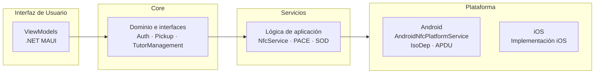
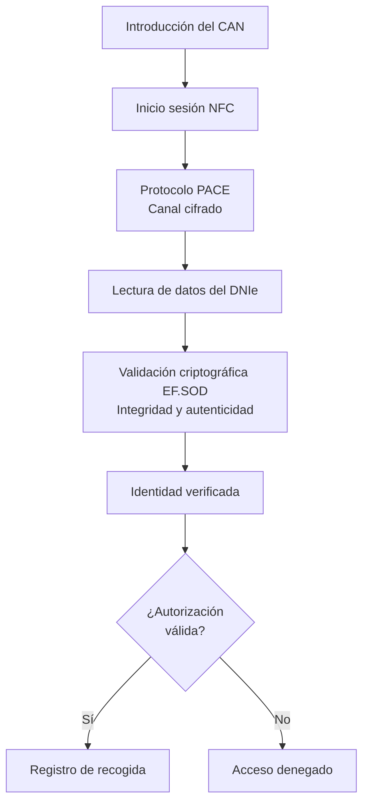

# DIAGRAMAS COLEHOP

## DIAGRAMA DE ARQUITECTURA DE LA APLICACIÓN

```mermaid
flowchart LR

    subgraph UI_LAYER["Interfaz de Usuario"]
        UI["ViewModels<br>.NET MAUI"]
    end

    subgraph CORE_LAYER["Core"]
        Core["Dominio e interfaces<br>Auth · Pickup · TutorManagement"]
    end

    subgraph SERVICES_LAYER["Servicios"]
        Services["Lógica de aplicación<br>NfcService · PACE · SOD"]
    end

    subgraph PLATFORM_LAYER["Plataforma"]
        Android["Android<br>AndroidNfcPlatformService<br>IsoDep · APDU"]
        iOS["iOS<br>Implementación iOS"]
    end

    UI --> Core --> Services --> PLATFORM_LAYER
```

## DIAGRAMA DE FLUJO DE VERIFICACIÓN DE IDENTIDAD CON DNIe

```mermaid
flowchart TB
    CAN["Introducción del CAN"]
    NFC["Inicio sesión NFC"]
    PACE["Protocolo PACE<br>Canal cifrado"]
    DG["Lectura de datos del DNIe"]
    SOD["Validación criptográfica EF.SOD<br>Integridad y autenticidad"]
    ID["Identidad verificada"]
    AUTH{"¿Autorización<br>válida?"}
    LOG["Registro de recogida"]
    END["Acceso denegado"]

    CAN --> NFC --> PACE --> DG --> SOD --> ID --> AUTH
    AUTH -->|Sí| LOG
    AUTH -->|No| END
```